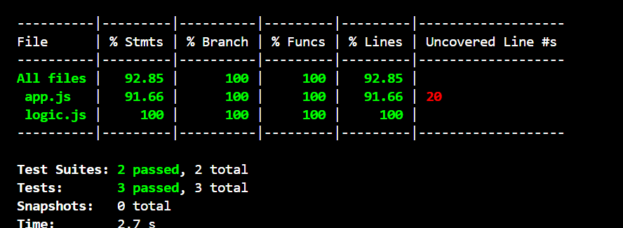

# Keploy API Fellowship Session 3 Assignment

This repository contains my solution for the Keploy API Fellowship Session 2 assignment.

## Project Overview

- Built a custom API server using Node.js and Express.
- Integrated MongoDB for data persistence.
- Implemented unit, integration, and API tests using Jest and Supertest.
- Used `mongodb-memory-server` to run tests against an in-memory MongoDB instance.

## API Description

This API server provides CRUD operations for managing items (or your main resource). The key endpoints include:

- `GET /items` — Retrieve all items
- `POST /items` — Create a new item
- `GET /items/:id` — Retrieve an item by ID
- `PUT /items/:id` — Update an item by ID
- `DELETE /items/:id` — Delete an item by ID

## Testing Approach

- **Unit Tests:** Cover core business logic with both mocked and real database scenarios.
- **Integration Tests:** Verify interactions between the API server and MongoDB using `mongodb-memory-server`.
- **API Tests:** Ensure API endpoints respond correctly using Supertest.
- Test coverage generated with Jest.
- ## Test Coverage




## How to Run

1. Clone the repo:

   ```bash
   git clone https://github.com/shaswat770/keploy-api-test.git
   cd keploy-api-test
````

2. Install dependencies:

   ```bash
   npm install
   ```

3. Run tests with coverage:

   ```bash
   npm test -- --coverage
   ```


---

Thank you for the opportunity to participate!

---

*Created by Shaswat Kumar Jha*

```

---


`
